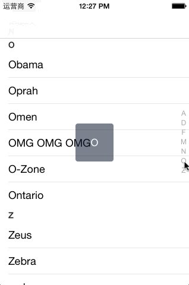

BATableView
===========

欢迎关注我的博客   www.beyondabel.com

BATableViewKit是自定义列表中的索引栏（Index Bar）。手指滑动 index bar 时，中间会出现黑色小浮块，并把index Bar上的字显示在黑色小浮块上，黑色小浮块上的字会随手指index bar 变换。

### 如何去使用BATableView

1. 创建BATableView

		BATableView *contactTableView = [[BATableView alloc] initWithFrame:self.view.bounds];
    	contactTableView.delegate = self;
    	[self.view addSubview:self.contactTableView];

2. 实现BATableViewDelegate、UITableViewDataSource、UITableViewDelegate协议

### License

BATableView is published under MIT License
